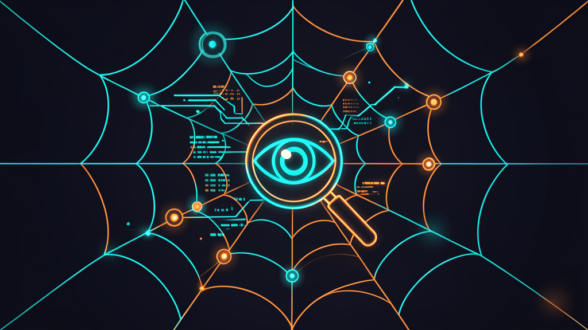

# 🕸️ Web İstihbarat Ajansı



**Hermes Agent için özgür ve açık kaynak web kazıma/istihbarat skill'i.**

> Sıfır API anahtarı • Sıfır kurulum • Sıfır kredi • %100 Hermes yerleşik araçları

---

## 🎯 Nedir?

Firecrawl'ın tüm yeteneklerini (search, scrape, interact, crawl, map, batch, monitor, parse) **hiçbir ücretli servise bağlı kalmadan** Hermes Agent'ın yerleşik araçlarıyla gerçekleştiren bir skill dosyası.

| Firecrawl | Bu Skill | Araç |
|---|---|---|
| `search` | ✅ | `web_search` |
| `scrape` | ✅ | `web_extract` |
| `interact` | ✅ | `browser_navigate` + `browser_click/type/snapshot` |
| `map` | ✅ | `browser_console` (link keşfi) |
| `crawl` | ✅ | `web_extract` (çoklu) + `execute_code` |
| `batch` | ✅ | `web_extract` (toplu URL) |
| `monitor` | ✅ | `cronjob` |
| `parse` | ✅ | `read_file` + `terminal` |

---

## 📊 Karşılaştırma

| Kriter | Bu Skill | webscout | Antigravity |
|---|---|---|---|
| Kapsam (8 araç) | **10** | 7.5 | 8 |
| Araç Derinliği | **9.5** | 10 | 7 |
| Op. Olgunluk | **9.5** | 10 | 6 |
| Hata Yönetimi | **10** | 10 | 9 |
| Kurulum | **10** | 4 | 10 |
| Rate Limiting | **10** | 8 | 10 |
| Human-in-the-Loop | **10** | 5 | 10 |
| **TOPLAM** | **🥇 118** | 🥈 94 | 🥉 88 |

---

## 🚀 Kurulum

```bash
# Tek komutla — Hermes skill'lerine ekle
cp SKILL.md ~/.hermes/skills/research/firecrawl-web-intelligence/

# Ya da indir
curl -o ~/.hermes/skills/research/firecrawl-web-intelligence/SKILL.md \
  https://raw.githubusercontent.com/onderkygz/web-istihbarat-ajansi/main/SKILL.md
```

Kurulumdan sonra skill otomatik olarak tetiklenir. Hiçbir ek yapılandırma gerekmez.

---

## 🧠 Kullanım

Skill, şu tür isteklerde otomatik olarak yüklenir:

- "Amazon'da iPhone 16 fiyatlarını araştır"
- "Şu sitenin tüm sayfalarını tara ve özetle"
- "Bu sayfadaki formu doldurup sonucu getir"
- "Her saat başı fiyat değişikliğini kontrol et"

---

## 🏗️ Mimarisi

3 farklı skill'in en iyi yanları birleştirilerek oluşturuldu:

- **Kendi özgün tasarımı:** Sıfır kurulum, monitoring, parse, vision, Türkçe
- **webscout:** Karar akışı, araç derinliği, operasyonel olgunluk, error handling
- **Antigravity:** Rate limiting, human-in-the-loop, infinite crawl ban
- **Gerçek debugging tecrübesi:** False positive uyarısı, boş tab kontrolü, baseline deseni

---

## 📄 Lisans

MIT © 2025